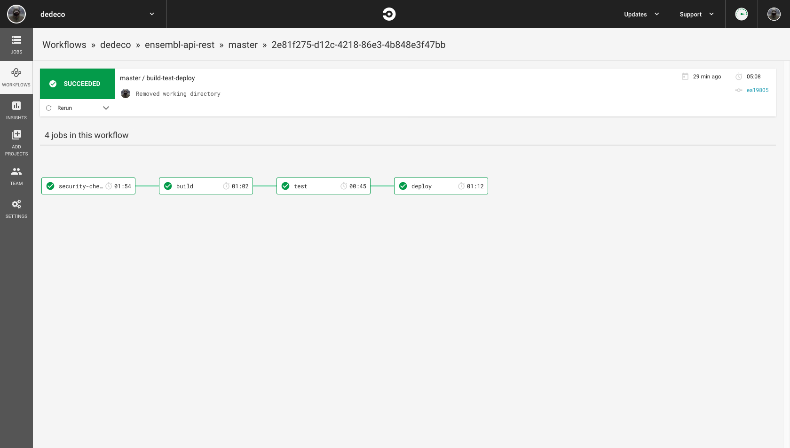

# Ensembl Api for search genes

[](https://circleci.com/gh/dedeco/ensembl-api-rest/tree/master)
## Run api local
The putative “Ensembl Services Platform” allows users to search for a gene by its name. One web REST service
is available on this platform to get all gene names corresponding to a pattern.

1.  How do I get set up this api? Install python +3.7 and create a virtualenv using pipenv:
    [See here how to](https://github.com/pypa/pipenv).

2.  Create and running a virtualenv
    ```
    user@server:~$ pipenv shell
    ```
3.  Running tests 
    ```
    user@server:~$ pipenv run pytest -v
    ```
4. Running api App:
    ```
    (ensembl-api-env) user@server:~$ FLAKS_APP=app.py
    (ensembl-api-env) user@server:~$ flask run
    ```
    
    The api will be available on http://127.0.0.1:5000/api/v1/genes
    
    A GET request example
    
    ``` 
    http://127.0.0.1:5000/api/v1/genes?lookup=brc&species=sapiens&limit=3
    ```

      - LIMIT: 3
      - Gene name lookup: "brc"
      - Species: "sapiens"

    Response example:
    
   ```
    {
        "start": 1,
        "limit": 3,
        "count": 4,
        "previous": "",
        "next": "/api/v1/genes?start=4&limit=3&lookup=brc&species=sapiens",
        "results": [
            {
                "species": "homo_sapiens",
                "ensembl_stable_id": "ENSG00000012048",
                "gene_name": "BRCA1",
                "location": "17:43044295-43170245"
            },
            {
                "species": "homo_sapiens",
                "ensembl_stable_id": "ENSG00000139618",
                "gene_name": "BRCA2",
                "location": "13:32315474-32400266"
            },
            {
                "species": "homo_sapiens",
                "ensembl_stable_id": "ENSG00000185515",
                "gene_name": "BRCC3",
                "location": "X:155071420-155123074"
            }
        ]
    }
   ```

## Continuous Delivery (Circle Ci and Heroku)

1.  When we push on master will trigger the pipeline on Circle Ci as following:

- Security check
- Build (using a gpg to decrypt the private key)
- Tests
- Deploy on Heroku

On file .circleci/config.yml the workflow/jobs to build-test-deploy.

Here a workflow example after running:



Here a specif example of tests passed on job tests:


2. If pipeline runs with successful, all tests passed, the app will be deploy on Heroku.

It can be found on: https://ensembl-api-rest-app.herokuapp.com/api/v1/genes?start=26&limit=25&lookup=brca (Here an example search by gene name)

Here an example requesting using Postman:


  
